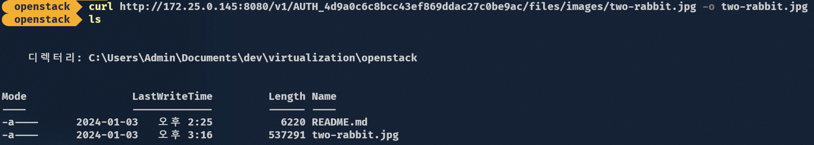
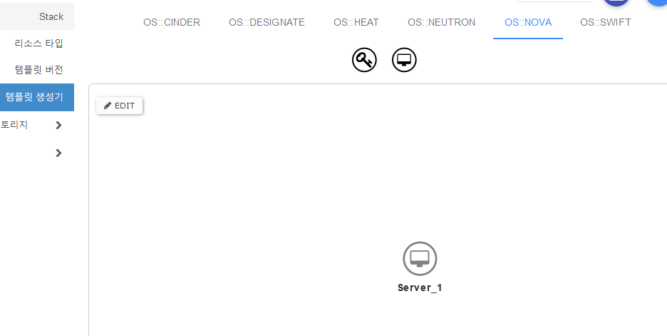
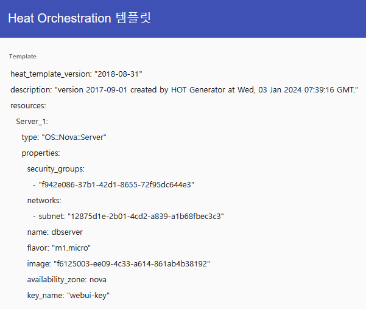

# Openstack (Private Cloud)

- Openstack은 CMP(Cloud Management Platform)으로 데이터 센터 전반에 걸쳐 모든 리소스를 Pooling하여 제어해서 Private Cloud 혹은 Public Cloud를 구축하고 관리하는 오픈소스 소프트웨어로 파이썬으로 만들어져 있다.

- 동일한 목적의 Cloudstack도 있고 가장 사용량이 많은 것은 Openstack이다.

- Private Cloud를 구축하기 위해 사용하지만 Public Cloud를 구축해서 서비스를 제공하는 데에도 사용된다.

- 오픈스택 설치시 가상의 브릿지 네트워크 인터페이스가 생기며 그 중 br-ex가 기존 VM의 NAT 인터페이스가 가진 IP와 네트워크 정보를 가지고 게이트웨이와 연결된 vSwitch의 역할을 하며 내부와 외부의 트래픽이 서로 오고 갈 수 있도록 해준다.

- 오픈스택 내의 인스턴스와 통신하려면 external <-> internal을 연결하는 라우터가 가리키는 외부 게이트웨이를 통해서 해야 한다.

- `systemctl is-active openstack-*`

- **_위 네트워크 구조는 나중에 시간 될때 다시 정리_**

- 프로젝트 단위로 구분되어 그 안에 neutron 네트워크를 구성할 수 있다. 프로젝트를 리전으로 볼 수 있다??

## Openstack Core Service

- 컴퓨팅 서비스로는 nova가 있고 AWS EC2와 같다고 볼 수 있다.

- 네트워크는 neutron이 VPC 같은 개념이며 neutron 내에서 여러 리소스들이 스위치, 라우터, 브릿지 등의 역할을 한다.

- 스토리지는 블록 스토리지는 cinder로 AWS EBS와 같고 파일 시스템 스토리지는 manila로 다른 퍼블릭 클라우드의 NAS와 같은 역할을 한다. 오브젝트 스토리지는 swift가 있다.

- manila와 swift는 Core Service는 아니다. 없어도 실행이 가능하기 때문에 Optional Service이다.

- 인스턴스에 적용되는 이미지 서비스로는 glance가 있다.

- 인증, 인가 서비스는 keystone이 있고 계정, 계정의 암호, 권한 등을 설정한다.

## Keystone

- AWS IAM과 비슷한 역할을 하는 인증, 인가 서비스이다.

- 역할(role)은 콘솔에서 편집할 수 있는 부분은 이름밖에 없고 구체적은 역할을 새로 생성하려면 별도의 개발이 필요하다.

- 기존에 생성되어 있는 역할을 사용

## Flavor

- 인스턴스 타입을 의미한다.

- m1.tiny(cpu 1, RAM 512MB, SSD 1GB) ~ m1.xlarge(cpu 8, RAM 16GB, SSD 160 GB)가 기본 Flavor로 생성되어 있다.

- 커스텀 Flavor를 직접 생성할 수 있다. CPU, RAM, Disk(Root, Ephemeral, Swap) 등을 명시할 수 있다.

## Neutron

- 네트워크를 생성할 때 생성할 네트워크가 속하게 될 프로젝트를 명시하고 공급자 네트워크, 물리적 네트워크를 명시한다. 공급자 네트워크는 Openstack에서 제공되는 서비스 중 어떤 것을 사용할지이고 물리적 네트워크는 Openstack 설치시에 명시했던 네트워크 인터페이스의 Alias인 듯 하다. 실습에서는 Flat을 선택하고 vm에서 부여받은 Openstack이 설치된 VM의 네트워크 인터페이스의 Alias를 명시해서 외부 네트워크를 구성했다.

- 위 네트워크 생성 방식은 admin 계정에서만 가능한 것으로 보이며 전체 네트워크가 외부와 통신할 수 있는 하나의 external network라고 명명한 가상 네트워크 공간을 만드는 내용이였는데 이 권한이 admin만 가능하고 다른 계정은 그 네트워크 안쪽에 내부 네트워크만 구성할 수 있고 external network를 통해 외부와 통신하는 듯 하다.

- 서브넷에 구체적으로 IP를 할당할 IP Pools를 명시할 수 있다.

### Floating IP

- Elastic IP처럼 IP를 서버 인스턴스에 맵핑할 수 있는 네트워크 내 서비스이다.

- 미리 구축한 External Network의 IP 대역 내에서 할당이 가능하다.

- IP의 주소는 대역 내에서 랜덤하게 정해진다.

### Security Group

- AWS의 Security Group과 거의 유사하다. 똑같이 인바운드는 기본적으로 All Deny이고 아웃바운드는 All Allow이다.

- 룰은 허용할 White List만 명시한다.

- AWS SG와 마찬가지로 특정 SG를 대상으로 하는 규칙 설정이 가능하며 이를 통해 특정 SG에 대한 룰 외의 Source를 차단하여 보안성을 높인 아키텍처를 구축할 수 있다.

## Glance

- AWS AMI처럼 인스턴스의 베이스 이미지를 설정할 수 있다.

- iso를 연결하고 최소 사양 등을 명시할 수 있다.

## Key Pair

- AWS의 인스턴스 키 페어와 거의 동일하다.

## Nova

- EC2 인스턴스를 생성하는 것과 비슷하게 인스턴스 타입과 미리 생성해둔 Glance 이미지를 선택하고 속할 네트워크, 서브넷을 선택하고 생성해둔 보안 그룹을 적용하고 사용할 키 페어를 설정한다.

- 인스턴스 생성 시 구성 항목에서 AWS EC2 User Data처럼 인스턴스가 시작할 때 실행될 자동화 스크립트를 사용할 수 있다.

- 인스턴스 생성에 필요한 이미지를 Openstack.org에서 찾아서 사용할 수 있다. 이미지 파일 포멧은 .img, .qcow2 모두 QCOW2 포멧으로 취급된다.

## Cinder

- Cinder는 AWS EBS와 같이 인스턴스와 직접 연결되는 기본 블록 스토리지이다.

- 스냅샷, 볼륨 복제 등의 백업 기능을 지원한다.

- 생성된 볼륨 ID를 사용자가 구분하기 쉽게 변경할 수 있다.

### Cinder와 Nova의 연동

- Nova 인스턴스의 생성시 블록 스토리지를 포함하고 있다면 Cinder 블록 스토리지가 생성이되고 `nova volume-attach` 명령을 통해 인스턴스에 붙고 이때 스토리지의 연결은 iSCSI로 연결된다.

- 생성된 Cinder가 하나의 iSCSI 스토리지이고 iSCSI 연결과 같은 논리로 Nova 인스턴스에 연결되어 있는 것이다.

## Swift

- Swift는 AWS S3와 같은 오브젝트 스토리지이다.

- 각 객체는 고유한 식별자인 URL을 가지고 있다.

- Swfit를 포함해 모든 오브젝트 스토리지는 용량이 큰 고해상도의 이미지나 영상 등의 파일들을 저장하기 위해 사용된다.

- Swift 내 오브젝트 파일의 그룹의 단위는 컨테이너이고 S3의 버킷과 같다.

- public access 항목을 체크하면 링크가 생기고 그 링크를 통해 Swift 컨테이너 내의 객체에 접근이 가능하다.

- 

- 상대경로로 작성된 파일 내의 경로가 컨테이너 내에서도 적용이 된다. Swift 내에 배포할 정적 파일을 올바르게 배치하면 엔트리 포인트 html 파일의 Swift URL로 접속하면 동일하게 배포된 것을 확인할 수 있다.

## Heat

- Openstack에서 제공되는 IaC 툴이다. AWS CloudFormation과 유사하다.

- 작성 방식은 간단하다. heat template의 버전을 명시하고 생성할 리소스를 명시하고 세부적인 프로퍼티를 명시한다.

- 서버를 생성한다면 다음과 같다.

```yaml
heat_template_version: "2018-08-31"
resources:
  Server_web:
    type: "OS::Nova::Server"
    properties:
      security_groups:
        - "a22046bd-1008-4700-884e-470e0aa2f5b9"
      networks:
        - subnet: "12875d1e-2b01-4cd2-a839-a1b68fbec3c3"
      name: "webserver"
      flavor: "m1.micro"
      image: "a59ed042-3356-453a-a752-2f0c0b9e7bdf"
      availability_zone: "nova"
      key_name: "webui-key"	
```

- **_한 템플릿으로 생성되는 리소스들은 하나의 스택 단위로 묶여있다. 오픈스택 웹에서 Heat 스택을 삭제하면 그 템플릿으로 생성한 리소스도 같이 삭제된다._**

- yaml 스크립트 작성 외에도 웹 UI에서 템플릿을 더 쉽게 작성할 수도 있다.

- 

- 

## Designate

- Openstack이 제공하는 DNS 서비스이다.